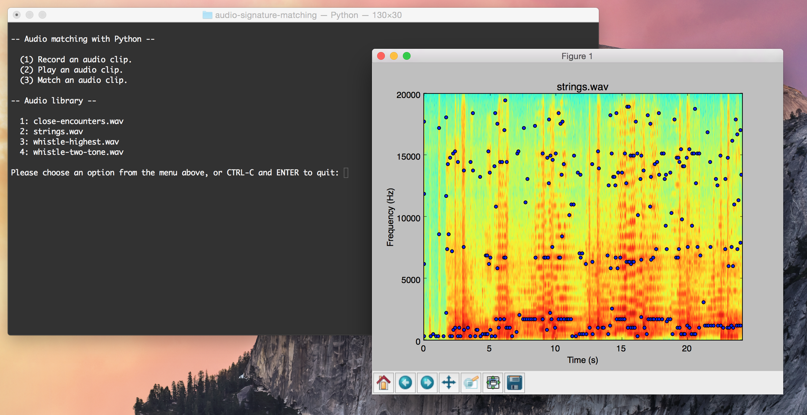

# audio-signature-matching
Learning about audio I/O, FFT, and spectrograms using Python. An attempt to create and match audio signatures.

Python 2.7.9
Required modules/libraries:
- Installing with Homebrew package manager highly recommended. (http://brew.sh)
- PyAudio (https://people.csail.mit.edu/hubert/pyaudio/)
- Audiolab (http://cournape.github.io/audiolab/)
- NumPy, SciPy, and Matplotlib (http://scipy.org)

##Current status
At this point recording, playback, and audio signature creation are working. However, the parameters for finding local maxima in the signature creation step could use some tuning. Matching of signatures is not yet implemented.
